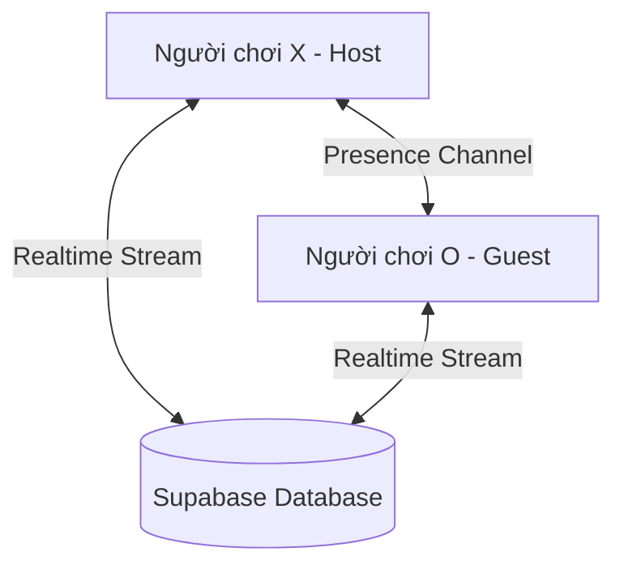

# Cờ Caro Champion 🏆

Dự án game cờ Caro (Tic-Tac-Toe) viết bằng Flutter, giao diện hiện đại hỗ trợ chế độ chơi Local (Offline) và chơi Online Realtime được đồng bộ thông qua **Supabase**.

## Các Tính Năng Nổi Bật

- **Giao diện hiện đại**: Cấu hình theme tối (Dark Mode) sang trọng, kết hợp hiệu ứng nhấp nháy, đổi màu trực quan khi người chơi thắng cuộc.
- **Chế độ chơi Offline (Local)**: Chơi 2 người trên cùng một thiết bị.
- **Chế độ chơi Online Realtime**:
  - Tạo phòng chơi mới với mã phòng 4 chữ số được sinh ngẫu nhiên.
  - Tham gia phòng chơi bằng cách nhập mã phòng của đối thủ.
  - Đồng bộ hóa nước đi, đi lại (Undo), bắt đầu lại (Reset) và cấu hình trận đấu ngay lập tức thông qua **Supabase Realtime Database**.
  - Tự động phát hiện trạng thái kết nối của đối thủ bằng **Supabase Presence**.
- **Đồng hồ đếm ngược**: Giới hạn thời gian suy nghĩ cho mỗi nước đi (15 giây, 30 giây hoặc vô hạn).
- **Gợi ý AI (Heuristic)**: Thuật toán Heuristic thông minh giúp tìm nước đi tối ưu (Tấn công & Phòng thủ) khi nhấn nút gợi ý.
- **Thu phóng và Kéo bàn cờ**: Sử dụng `InteractiveViewer` cho phép thu phóng (pinch to zoom) và kéo bàn cờ mượt mà (hữu ích cho cỡ bàn cờ lớn như 20x20).

---

## Kiến Trúc Hệ Thống Online

Trò chơi sử dụng cơ sở dữ liệu Supabase làm trung tâm điều phối trạng thái:



1. **Bảng `rooms`**: Mỗi phòng chơi tương ứng với một bản ghi chứa thông tin bàn cờ, lịch sử nước đi, và lượt đi hiện tại. Khi một người chơi thao tác (ví dụ: đánh cờ, undo, reset), trạng thái tương ứng trong bản ghi sẽ được cập nhật.
2. **Realtime Stream**: Cả hai người chơi đều đăng ký nhận luồng dữ liệu thay đổi từ bản ghi phòng đó. Khi bản ghi thay đổi, ứng dụng tự động dựng lại giao diện dựa trên thông tin mới nhất từ database.
3. **Supabase Presence**: Được cấu hình trên kênh realtime để phát hiện khi có thiết bị kết nối vào hoặc ngắt kết nối đột ngột khỏi phòng chơi.

---

## Hướng Dẫn Cài Đặt

### 1. Yêu cầu hệ thống
- Flutter SDK (đã kiểm thử tương thích tốt với SDK hiện tại).
- Supabase CLI (nếu muốn đẩy schema qua dòng lệnh).

### 2. Thiết lập cơ sở dữ liệu Supabase
Bạn cần tạo bảng `rooms` trên Supabase bằng một trong hai cách dưới đây:

#### Cách 1: Sử dụng Supabase CLI (Khuyên dùng)
Chạy các lệnh sau tại thư mục gốc của dự án:
```bash
# Liên kết dự án với remote project caro
supabase link --project-ref caddicxvszitasqahdck

# Đẩy migration lên database
supabase db push
```

#### Cách 2: Copy-paste SQL trực tiếp trên Web Dashboard
1. Truy cập vào [Supabase Dashboard Caro Project](https://supabase.com/dashboard/project/caddicxvszitasqahdck/sql/new) và tạo một SQL query mới.
2. Sao chép nội dung script SQL từ file [20260606000000_create_rooms_table.sql](file:///d:/cờ%20caro/supabase/migrations/20260606000000_create_rooms_table.sql).
3. Nhấn **Run** để khởi tạo bảng và cấu hình Realtime/RLS Policies.

---

## Hướng Dẫn Chạy Dự Án

1. Cài đặt các thư viện liên quan:
   ```bash
   flutter pub get
   ```
2. Chạy ứng dụng trên thiết bị giả lập hoặc trình duyệt:
   ```bash
   flutter run
   ```
